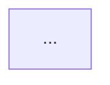
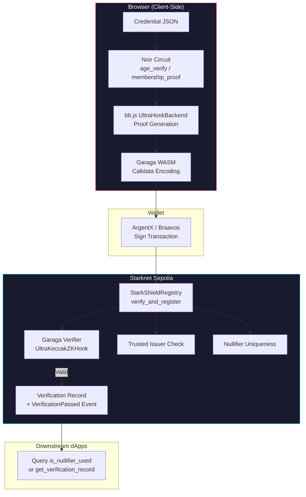

# Phase 8: Demo & Submission - Research

**Researched:** 2026-02-15
**Domain:** Hackathon submission packaging, demo video production, README documentation, DoraHacks BUIDL
**Confidence:** HIGH

## Summary

Phase 8 is the final packaging phase for the Starknet Re{define} Hackathon submission. The project (StarkShield -- a privacy-preserving credential verification protocol on Starknet) is functionally complete through Phase 7. All circuits, contracts, SDK, and web application are built and deployed. This phase produces three deliverables: (1) a demo video of 3 minutes or less showing the complete end-to-end flow, (2) a comprehensive README with Mermaid architecture diagram and verified setup commands, and (3) the DoraHacks BUIDL submission with all required metadata.

The deadline is **February 28, 2026** (the PRD states 23:59 UTC). The DoraHacks platform actually shows submissions close March 1, 2026 at 03:59 (which aligns with Feb 28 23:59 UTC). This is the Privacy track of the Starknet Re{define} Hackathon. The project is a solo developer (Vincent) augmented by Claude as AI pair programmer.

**Primary recommendation:** Prioritize the README and demo video quality over any new features. The README must work from a clean clone, and the demo video must show the full flow without cuts hiding errors. Judges evaluate technical depth and impact -- a polished demo showing a working end-to-end ZK verification pipeline is the strongest possible submission.

## Standard Stack

### Core (Already Built -- No New Libraries Needed)

| Tool | Version | Purpose | Status |
|------|---------|---------|--------|
| Noir (Aztec) | 1.0.0-beta.16 | ZK circuit language | Built (age_verify + membership_proof) |
| Barretenberg (bb.js) | 3.0.0-nightly.20251104 | Proof generation/verification | Integrated in SDK |
| Garaga SDK | 1.0.1 | Cairo verifier generation + calldata | Contracts deployed |
| Cairo / Scarb | 2.14.0 | Smart contract language + build tool | Contracts deployed |
| starknet.js | 8.x | Wallet + transaction submission | Integrated in SDK |
| React + Vite + TailwindCSS | 19.x / 6.x / 4.x | Web frontend | Built (3 views) |
| Vercel | Free tier | Static hosting | Planned deployment target |

### Demo & Submission Tools

| Tool | Purpose | When to Use |
|------|---------|-------------|
| OBS Studio or QuickTime | Screen recording for demo video | Record demo at 1080p 30fps |
| YouTube (unlisted) | Host demo video | Upload after recording, get share link |
| Mermaid (GitHub-native) | Architecture diagram in README | Rendered natively by GitHub markdown |
| vercel CLI or GitHub integration | Deploy web app | Static site deployment |
| DoraHacks BUIDL platform | Hackathon submission | Final submission with all links |

### Alternatives Considered

| Instead of | Could Use | Tradeoff |
|------------|-----------|----------|
| YouTube unlisted | Loom | Loom has 5-min free limit, YouTube is universally accessible |
| OBS Studio | QuickTime (macOS) | QuickTime simpler but less control; OBS gives better quality settings |
| Vercel | Netlify, GitHub Pages | Vercel has best Vite support and easy header configuration |
| Mermaid in markdown | Static PNG diagram | Mermaid renders natively on GitHub, no image hosting needed |

## Architecture Patterns

### Project Structure (Current -- What README Must Document)

```
starkshield/
+-- circuits/                    # Noir ZK circuits
|   +-- crates/
|       +-- age_verify/          # Age >= threshold circuit
|       +-- membership_proof/    # Group membership circuit
|       +-- shared_lib/          # Poseidon2 wrapper, sig utils
|   +-- Nargo.toml               # Workspace config
+-- contracts/                   # Cairo smart contracts
|   +-- src/
|       +-- honk_verifier.cairo  # Garaga-generated verifier
|       +-- registry.cairo       # Verification registry + issuer trust
|       +-- ownable.cairo        # Hand-rolled ownable
|   +-- Scarb.toml
+-- contracts_age_verifier/      # Standalone verifier (age)
+-- contracts_membership_verifier/ # Standalone verifier (membership)
+-- sdk/                         # TypeScript SDK + React web app
|   +-- src/                     # Core SDK (prover, submitter, wallet, reader)
|   +-- app/                     # React SPA (3 views)
|   +-- public/                  # Static assets (credentials, VK, WASM)
|   +-- vite.config.ts
+-- scripts/                     # Demo credential issuer
|   +-- issuer.ts                # Generates signed demo credentials
+-- deployments.json             # All contract addresses + tx hashes
+-- README.md                    # TO BE CREATED
```

### Pattern 1: Demo Video Script Structure (3 Minutes)

**What:** A tightly scripted 3-minute demo following the proven hackathon demo formula.
**When to use:** Required for DEMO-02.

Recommended time breakdown (from Implementation Plan and hackathon best practices):

```
0:00-0:15  Problem Statement      - One slide: privacy-compliance dilemma
0:15-0:30  Architecture Overview   - Mermaid diagram or slide showing flow
0:30-1:00  Credential Issuance     - Show demo credential via CLI/issuer script
1:00-1:45  Browser Proof Gen       - Live UI: select credential, generate proof, show timer
1:45-2:15  On-Chain Verification   - Submit proof, show Starkscan confirmation
2:15-2:30  Second Credential Demo  - Quick membership proof (shows flexibility)
2:30-2:45  Integration Potential   - How dApps plug in (show registry query)
2:45-3:00  GitHub Link + Next Steps
```

### Pattern 2: README Structure for Hackathon Judges

**What:** A judge-optimized README that answers "what, why, how" in under 2 minutes of reading.
**When to use:** Required for DEMO-03.

```markdown
# StarkShield
> One-liner tagline

## Overview
- What it does (2-3 sentences)
- Why it matters (privacy-compliance problem)

## Architecture


## Quick Start
```bash
# Verified commands that work from clean clone
```

## Deployed Contracts (Sepolia)
| Contract | Address | Explorer Link |

## Tech Stack
| Layer | Technology |

## How It Works
1. Credential issuance
2. Proof generation (browser)
3. On-chain verification

## Demo
- [Demo Video](youtube-link)
- [Live App](vercel-link)

## Development
### Prerequisites
### Build from Source
### Run Tests

## License
```

### Pattern 3: Vercel Deployment with COOP/COEP Headers

**What:** The web app uses SharedArrayBuffer (via bb.js WASM) which requires cross-origin isolation headers.
**When to use:** Required for hosting the live demo.

The Vite dev server already sets these headers in vite.config.ts. For production Vercel deployment, a `vercel.json` must be created.

### Anti-Patterns to Avoid

- **Overly long README with implementation details:** Judges skim. Lead with impact, not implementation minutiae. Put deep technical details in separate docs/ files if needed.
- **Demo video showing code:** Judges want to see the product working, not code scrolling. Show features, not implementation. Code quality is assessed via GitHub.
- **Broken setup commands:** Every command in the README must be verified from a clean clone. A broken `npm install` or missing prerequisite kills credibility.
- **Missing contract addresses:** Sepolia contract addresses must be clickable Starkscan links. Judges will check if they resolve.

## Don't Hand-Roll

| Problem | Don't Build | Use Instead | Why |
|---------|-------------|-------------|-----|
| Architecture diagram | Static PNG image | Mermaid in GitHub markdown | GitHub renders Mermaid natively; stays in sync with code; no image hosting |
| Video hosting | Self-hosted video | YouTube unlisted | Universal playback, no bandwidth concerns, DoraHacks accepts YouTube links |
| Deployment headers (COOP/COEP) | Manual server setup | vercel.json headers config | 5 lines of JSON vs deploying a custom server |
| Demo credential generation | Manual JSON editing | Existing issuer.ts script | Script already generates valid signed credentials |

**Key insight:** This phase produces no new code. It packages existing work for maximum judge impact. Every minute spent on new features is better spent on README clarity and demo video polish.

## Common Pitfalls

### Pitfall 1: COOP/COEP Headers Missing on Vercel

**What goes wrong:** The deployed app loads but SharedArrayBuffer is undefined, causing bb.js WASM proof generation to fail. The app appears to work (React renders) but proof generation silently breaks.
**Why it happens:** Vite dev server has custom headers middleware but Vercel does not inherit vite.config.ts server settings.
**How to avoid:** Create `vercel.json` in the `sdk/` directory (or project root with correct build settings) with explicit COOP/COEP headers for all routes.
**Warning signs:** "SharedArrayBuffer is not defined" error in browser console on deployed site.

**Verified vercel.json pattern:**
```json
{
  "headers": [
    {
      "source": "/(.*)",
      "headers": [
        {
          "key": "Cross-Origin-Embedder-Policy",
          "value": "credentialless"
        },
        {
          "key": "Cross-Origin-Opener-Policy",
          "value": "same-origin"
        }
      ]
    }
  ]
}
```

Note: The vite.config.ts uses `credentialless` (not `require-corp`) for COEP, which is more permissive and avoids issues with external resources (Google Fonts, wallet extensions). The vercel.json must match.

### Pitfall 2: Demo Video Shows Errors or Slow Proof Generation

**What goes wrong:** During recording, proof generation takes longer than expected (e.g., 30+ seconds), or WASM initialization fails, or wallet connection has issues. This results in awkward pauses or visible errors.
**Why it happens:** Browser cold start, WASM not cached, wallet extension not configured for Sepolia, insufficient gas.
**How to avoid:** Do a full dry run before recording. Pre-warm the WASM by generating one proof before recording. Ensure Argent X / Braavos is configured for Sepolia testnet with funded ETH/STRK. Record on a clean browser profile with only the wallet extension installed.
**Warning signs:** First proof generation in a session takes significantly longer than subsequent ones.

### Pitfall 3: README Setup Commands Fail on Clean Clone

**What goes wrong:** Commands reference tools not mentioned in prerequisites, or dependency versions have drifted, or build artifacts are needed but not generated.
**Why it happens:** The developer's machine has accumulated state (global tools, cached builds) that a fresh clone won't have.
**How to avoid:** Test every README command from a fresh `git clone` in a new directory. Use explicit version requirements (Noir 1.0.0-beta.16, Scarb 2.14.0, Python 3.10, Node.js 20+). Document the `.tool-versions` file (project already uses asdf/mise).
**Warning signs:** Commands like `nargo build` or `scarb build` fail with version mismatch errors.

### Pitfall 4: DoraHacks Submission Incomplete or Rejected

**What goes wrong:** Submission is not approved by organizers because required fields are missing, video link is broken, or GitHub repo is private.
**Why it happens:** DoraHacks BUIDL requires specific fields (project description 250+ words, GitHub link, demo video link, track selection). Organizer must approve submission before it appears in the gallery.
**How to avoid:** Submit early (DoraHacks allows editing until deadline). Double-check all links resolve. Ensure GitHub repo is public. Include all required hackathon-specific fields.
**Warning signs:** Submission stays in "pending review" status.

### Pitfall 5: Contract Addresses Don't Resolve on Starkscan

**What goes wrong:** README lists contract addresses but they show as "not found" on Starkscan, or point to wrong contracts.
**Why it happens:** Sepolia addresses were redeployed but README/deployments.json not updated, or addresses were copied incorrectly.
**How to avoid:** Verify every address in README by clicking the Starkscan link before submission. Current verified addresses from deployments.json:
- Age Verifier: `0x9afed88f1d6bb0da51d98d29a3aaca31ed7ca99dc51a3df06931c543694f52`
- Membership Verifier: `0x483b48c3dbd32ebbc45b22a2a419c9a95c3999b103f5eb4a3048a0e8000d1da`
- Registry: `0x054ca264033ae3b5874574c84de9c6086d94a66fb65445e455a8cef3137b7fab`

### Pitfall 6: GitHub Link in Footer Points to Wrong Repo

**What goes wrong:** The Layout.tsx footer currently links to `https://github.com/anthropics` (placeholder). Judges clicking this won't find the project.
**Why it happens:** Placeholder URL from Phase 7 that was never updated.
**How to avoid:** Update the GitHub link in `sdk/app/components/Layout.tsx` to point to the actual repository URL before deployment.

## Code Examples

### Verified: vercel.json for Cross-Origin Isolation

```json
// Source: Vercel docs + project's vite.config.ts (credentialless mode)
{
  "buildCommand": "cd sdk && npm install && npm run build",
  "outputDirectory": "sdk/dist",
  "headers": [
    {
      "source": "/(.*)",
      "headers": [
        {
          "key": "Cross-Origin-Embedder-Policy",
          "value": "credentialless"
        },
        {
          "key": "Cross-Origin-Opener-Policy",
          "value": "same-origin"
        }
      ]
    }
  ]
}
```

### Verified: Mermaid Architecture Diagram for README



Note: This Mermaid diagram will render natively on GitHub. Test rendering by previewing in a GitHub gist or the repo's README preview before submission.

### Verified: Deployed Contract Addresses Table for README

```markdown
## Deployed Contracts (Starknet Sepolia)

| Contract | Address | Explorer |
|----------|---------|----------|
| StarkShieldRegistry | `0x054ca264...7b7fab` | [Starkscan](https://sepolia.starkscan.co/contract/0x054ca264033ae3b5874574c84de9c6086d94a66fb65445e455a8cef3137b7fab) |
| Age Verifier | `0x9afed88...94f52` | [Starkscan](https://sepolia.starkscan.co/contract/0x9afed88f1d6bb0da51d98d29a3aaca31ed7ca99dc51a3df06931c543694f52) |
| Membership Verifier | `0x483b48c...0d1da` | [Starkscan](https://sepolia.starkscan.co/contract/0x483b48c3dbd32ebbc45b22a2a419c9a95c3999b103f5eb4a3048a0e8000d1da) |

**Verification transactions:**
| Action | Tx Hash |
|--------|---------|
| Registry Deploy | [`0x005dd7f...0a24`](https://sepolia.starkscan.co/tx/0x005dd7fb3322a9c4683d725b98687da9c799a268d44cbf965ea2553b6f2b0a24) |
| Add Age Issuer | [`0x04c62ea...2d06`](https://sepolia.starkscan.co/tx/0x04c62eacb6379a3297888a61a8fac0f44727c7950b15f82bb7f834e543d22d06) |
| Age Verify+Register | [`0x00556479...6958`](https://sepolia.starkscan.co/tx/0x00556479e6a2c1edafc3e8aad71fc020519cb0252576894ca37f5b1091116958) |
```

### Verified: Prerequisites Section for README

```markdown
## Prerequisites

| Tool | Version | Install |
|------|---------|---------|
| Node.js | 20+ | [nodejs.org](https://nodejs.org) |
| Noir (nargo) | 1.0.0-beta.16 | `noirup -v 1.0.0-beta.16` |
| Scarb | 2.14.0 | `asdf install scarb 2.14.0` |
| Python | 3.10.x | Required for Garaga SDK |
| Garaga | 1.0.1 | `pip install garaga==1.0.1` |

Or use the project's `.tool-versions` file with [mise](https://mise.jdx.dev/) or [asdf](https://asdf-vm.com/):
```bash
mise install  # installs noir 1.0.0-beta.16, scarb 2.14.0, python 3.10.14
```
```

## State of the Art

| Old Approach | Current Approach | When Changed | Impact |
|--------------|------------------|--------------|--------|
| Markdown static images for diagrams | Mermaid code blocks in GitHub markdown | GitHub added support 2022, now standard | No image hosting needed, diagrams stay in sync |
| Self-hosted demo videos | YouTube/Loom unlisted links | N/A (always standard for hackathons) | Universal access, no bandwidth issues |
| Manual deployment | Vercel with vercel.json config | N/A | One-click deploy with proper headers |

**Current Re{define} Hackathon specifics:**
- Submission platform: DoraHacks BUIDL (https://dorahacks.io/hackathon/redefine)
- Deadline: February 28, 2026 (23:59 UTC)
- Track: Privacy
- Prize pool: $9,675 USD in STRK tokens
- Judging criteria: Impact and technical depth
- Required: GitHub repo link, demo video (<=3 min), Starknet deployment link
- Can submit early and continue editing until deadline

## DoraHacks BUIDL Submission Checklist

Based on research of DoraHacks submission guides and Re{define} hackathon requirements:

### Required BUIDL Fields

1. **Project Name:** StarkShield
2. **Project Description:** Minimum 250 words. Should cover: what it does, how it works, technical architecture, why it matters for privacy on Starknet.
3. **Track Selection:** Privacy
4. **GitHub Link:** Must be public, with http/https:// prefix
5. **Demo Video Link:** YouTube unlisted or equivalent (<=3 min per hackathon rules)
6. **Team Info:** Solo developer (Vincent) + AI pair programmer
7. **Demo/Live Link:** Vercel deployment URL
8. **Contract Addresses:** Sepolia deployment addresses

### Recommended BUIDL Fields

9. **Logo/Icon:** StarkShield branding image
10. **Screenshots:** Web app screenshots (Credential Wallet, Proof Generator, Verification Dashboard)
11. **Tags:** zero-knowledge, privacy, starknet, noir, garaga, cairo

### Organizer-Specific Questions

The Re{define} hackathon may have custom questions in the submission form. Be prepared to answer questions about:
- How the project uses STARKs/ZK proofs
- Privacy guarantees and threat model
- Composability with other Starknet protocols
- Future development plans

## Demo Video Production Guide

### Recording Setup (macOS)

**Recommended tool:** OBS Studio or QuickTime Player
- Resolution: 1920x1080 (1080p)
- Frame rate: 30 fps (sufficient for UI demo)
- Format: MP4 (H.264)
- Audio: No voiceover required per Implementation Plan ("No voiceover rambling. Every second counts."); use text overlays or subtitles instead
- Browser: Clean Chrome profile with only wallet extension

### Pre-Recording Checklist

1. Wallet extension (ArgentX or Braavos) installed and configured for Sepolia
2. Wallet funded with STRK for gas (~5 STRK is sufficient for several verify_and_register calls)
3. Demo credentials loaded in sdk/public/credentials/
4. Run `npm run dev` in sdk/ to start local dev server
5. Do one full end-to-end proof generation to warm up WASM
6. Clear browser localStorage (fresh Verification Dashboard)
7. Set browser window to exact 1920x1080
8. Close all unnecessary tabs and notifications

### Post-Recording

1. Trim beginning/end (no desktop visible)
2. Add text overlays for each section (problem, demo, impact)
3. Upload to YouTube as unlisted
4. Verify link works in incognito/private window
5. Copy link for DoraHacks submission

## Open Questions

1. **Exact GitHub repository URL**
   - What we know: The project is at `/Users/laitsky/Developments/starkshield` with a git repo
   - What's unclear: The remote URL (GitHub username/org, repo name, public vs private)
   - Recommendation: Vincent must ensure the repo is public on GitHub before submission. The Layout.tsx footer link currently points to `https://github.com/anthropics` (placeholder) and must be updated.

2. **Vercel project setup**
   - What we know: Implementation plan specifies Vercel free tier for hosting
   - What's unclear: Whether a Vercel account is already set up, whether the project is already connected
   - Recommendation: Set up Vercel project, connect to GitHub repo. Use vercel.json with COOP/COEP headers. Verify live site works (especially WASM proof generation).

3. **Whether `sdk/node_modules` and `sdk/dist` should be in .gitignore**
   - What we know: Currently not in .gitignore (they appear as untracked in git status). The .gitignore only covers `scripts/node_modules/`
   - What's unclear: Whether they were intentionally left out
   - Recommendation: Add `sdk/node_modules/` and `sdk/dist/` to `.gitignore` before final commit. Also add `StarkShield_PRD.pdf` and `StarkShield_Implementation_Plan.pdf` if they should not be public.

4. **Clean clone verification**
   - What we know: Setup involves multiple toolchains (Noir, Scarb, Python/Garaga, Node.js)
   - What's unclear: Whether all commands work from a truly fresh environment
   - Recommendation: Test README commands in a fresh directory. Document exact versions and installation order.

## Sources

### Primary (HIGH confidence)
- Project codebase: Direct inspection of all source files, deployments.json, vite.config.ts, package.json
- StarkShield PRD v1.0 (Feb 13, 2026): Requirements DEMO-02, DEMO-03, DEMO-05
- StarkShield Implementation Plan v3 (Feb 13, 2026): Week 4 sprint plan, Day 26-28 tasks

### Secondary (MEDIUM confidence)
- [DoraHacks Re{define} Hackathon page](https://dorahacks.io/hackathon/redefine) - Submission deadline, track info, prize pool
- [Starknet Re{define} Hackathon official site](https://hackathon.starknet.org/) - Privacy track details
- [Vercel SharedArrayBuffer fix guide](https://vercel.com/kb/guide/fix-shared-array-buffer-not-defined-nextjs-react) - COOP/COEP header configuration
- [DoraHacks BUIDL Submission Guide](https://dorahacks.io/blog/dora-grant-dao/) - BUIDL field requirements
- [Hackathon demo video tips](https://tips.hackathon.com/article/creating-the-best-demo-video-for-a-hackathon-what-to-know) - Video production best practices
- [Mermaid.js on GitHub](https://github.com/mermaid-js/mermaid) - Native markdown diagram rendering

### Tertiary (LOW confidence)
- DoraHacks organizer-specific submission questions for Re{define} - Could not access the actual submission form; fields may differ from generic BUIDL format

## Metadata

**Confidence breakdown:**
- Standard stack: HIGH - All technology is already built and deployed; no new libraries needed
- Architecture: HIGH - Direct inspection of codebase reveals exact structure, contract addresses verified in deployments.json
- README patterns: HIGH - Well-established hackathon documentation practices
- Demo video structure: HIGH - Implementation Plan provides explicit script timing; verified against best practices
- Vercel deployment: HIGH - vercel.json header pattern is well-documented; COEP mode (credentialless) confirmed from vite.config.ts
- DoraHacks submission fields: MEDIUM - Could not access actual Re{define} submission form; based on DoraHacks general guides and cross-referencing multiple hackathon submission pages
- Pitfalls: HIGH - Identified from direct codebase inspection (e.g., placeholder GitHub link, missing .gitignore entries, COEP header requirement)

**Research date:** 2026-02-15
**Valid until:** 2026-02-28 (hackathon deadline)
