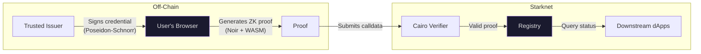

# StarkShield

**Prove who you are without revealing who you are.**

StarkShield lets users verify things about themselves: age, group membership, KYC status — to on-chain contracts on Starknet, without handing over any personal data. Credentials live on the user's device. Only ZK proofs hit the chain.

Built for the [Starknet Re{define} Hackathon](https://dorahacks.io/) — Privacy Track.

## The Problem

DeFi, DAOs, and on-chain apps increasingly need to know *something* about their users (are they old enough? are they a member? did they pass KYC?) — but the moment you put identity data on a transparent ledger, you've created a privacy disaster. Users shouldn't have to doxx themselves just to participate.

StarkShield fixes this: prove you qualify without proving who you are.

## How It Works



1. A trusted issuer signs a credential (age, membership, etc.) with a Poseidon-Schnorr signature
2. The user loads it in their browser — **it never leaves their device**
3. A Noir circuit proves the credential satisfies some condition (e.g. `age >= 18`) without leaking the actual value
4. The proof gets submitted to Starknet, where a Cairo verifier checks it
5. The Registry records the verification with a per-dApp nullifier — downstream dApps can query status without ever seeing private data

## Privacy Properties

- **Zero-knowledge** — proofs reveal nothing beyond the claim itself. "Age >= 18", not the actual age.
- **Unlinkable** — per-dApp nullifiers mean verifications can't be correlated across platforms.
- **Replay-resistant** — same context always yields the same nullifier, so you can't double-submit.
- **Client-side only** — proof generation happens entirely in WASM in the browser. No server ever touches private data.
- **Tamper-proof** — credential fields are Schnorr-signed; mess with them and the proof fails.

## What You Can Verify

**Age** — proves `attribute_value >= threshold` (e.g. age >= 18). Doesn't reveal the actual age, issuer identity, or user identity.

**Membership** — proves `attribute_value in allowed_set` (e.g. user belongs to a group). Doesn't reveal which member, the group size, or user identity.

Both circuits verify issuer signatures, check credential expiry, and derive per-dApp nullifiers.

## Judge Quickstart

Fastest way to see it working end-to-end. You just need [Bun](https://bun.sh/).

```bash
cd sdk
bun install
bun run dev
```

Then:

1. Open `http://localhost:5173`
2. Go to **Prove**, load a **Demo Credential**
3. Hit **Generate Proof** — runs entirely in-browser via WASM
4. *(Optional)* Connect an Argent X or Braavos wallet on Starknet Sepolia and click **Submit On-Chain**
5. Check the **Dashboard** to see stored verification metadata and on-chain confirmation

## Tech Stack

| Layer | Tech | Notes |
|-------|------|-------|
| ZK Circuits | [Noir](https://noir-lang.org/) 1.0.0-beta.16 | Age + membership verification logic |
| Proof System | UltraKeccakZK Honk | Bundled with Noir, Garaga-compatible |
| Signatures | Poseidon2-Schnorr | ~5-8K constraints vs ~25K for EdDSA |
| Verifier Gen | [Garaga SDK](https://github.com/keep-starknet-strange/garaga) 1.0.1 | Auto-generates Cairo verifiers from Noir circuits |
| Contracts | [Cairo](https://www.cairo-lang.org/) | Registry + verifier, deployed on Sepolia |
| Client SDK | TypeScript | noir_js + bb.js WASM proving, wallet integration |
| Frontend | React 19 + Vite 6 + Tailwind CSS 4 | Three-view SPA |
| Wallets | starknet.js v8 + get-starknet | Argent X and Braavos |

## Project Structure

```
starkshield/
├── circuits/                    # Noir ZK circuits
│   └── crates/
│       ├── shared_lib/          # Crypto primitives (Poseidon2, Schnorr, nullifiers)
│       ├── age_verify/          # Age circuit (1,224 ACIR opcodes)
│       └── membership_proof/    # Membership circuit (1,253 ACIR opcodes)
├── contracts/                   # Cairo smart contracts
│   └── src/
│       ├── registry.cairo       # Registry (issuer mgmt, nullifier tracking, verification log)
│       ├── honk_verifier.cairo  # Garaga-generated verifier
│       └── ownable.cairo        # Access control
├── sdk/
│   ├── src/                     # TypeScript SDK
│   │   ├── prover.ts            # Browser WASM proof generation
│   │   ├── wallet.ts            # Wallet connection (Argent X, Braavos)
│   │   ├── submitter.ts         # Proof transaction submission
│   │   ├── reader.ts            # On-chain verification queries
│   │   ├── credentials.ts       # Credential loading & validation
│   │   └── config.ts            # Contract addresses & chain config
│   └── app/                     # React frontend
│       ├── views/
│       │   ├── CredentialWallet.tsx       # Load & display credentials
│       │   ├── ProofGenerator.tsx         # Generate & submit proofs
│       │   └── VerificationDashboard.tsx  # View past verifications
│       └── components/
├── scripts/
│   └── issuer.ts                # Demo credential issuer
└── deployments.json             # Deployed contract addresses (Sepolia)
```

## Deployed Contracts (Starknet Sepolia)

| Contract | Address | Explorer |
|----------|---------|----------|
| Registry | `0x06f4c3158eca3a5109e3b08355bd160e621eee291a9860ba716199c5e8f86f94` | [Voyager](https://sepolia.voyager.online/contract/0x06f4c3158eca3a5109e3b08355bd160e621eee291a9860ba716199c5e8f86f94) |
| Age Verifier | `0x06e318af5da0aecca732fd0192305f4f755582f762186aa2b253e0d43d031023` | [Voyager](https://sepolia.voyager.online/contract/0x06e318af5da0aecca732fd0192305f4f755582f762186aa2b253e0d43d031023) |
| Membership Verifier | `0x0209c45d1040f0e0c6893ffacc390c2734dd61b03619b50ad9888dbe8311fe17` | [Voyager](https://sepolia.voyager.online/contract/0x0209c45d1040f0e0c6893ffacc390c2734dd61b03619b50ad9888dbe8311fe17) |

## Note for Integrators

StarkShield records *what was proven* on-chain so downstream dApps can enforce their own policies:

- **Age proofs** store a public threshold (e.g. ">= 18"). Your dApp should check that `threshold_or_set_hash` meets the minimum you require.
- **Membership proofs** store a public allowed-set hash. Your dApp should verify `threshold_or_set_hash` matches the hash of your intended allowed set.

## Building from Source

### Prerequisites

| Tool | Version | Notes |
|------|---------|-------|
| Bun | latest | [Install](https://bun.sh/) |
| Nargo | 1.0.0-beta.16 | [Noir compiler](https://noir-lang.org/docs/getting_started/installation/) |
| Scarb | 2.14.0 | [Cairo package manager](https://docs.swmansion.com/scarb/) — avoid 2.15.x, it causes infinite compilation with Garaga contracts |
| Python | 3.10 | Required by Garaga SDK (breaks on 3.11+) |

### Circuits

```bash
cd circuits
nargo build          # compile
nargo test --workspace  # test all circuit packages
```

### Contracts

```bash
cd contracts
scarb build          # compile
snforge test         # test
```

### Web App

```bash
cd sdk
bun install
bun run dev          # http://localhost:5173
```

### Demo Credentials

```bash
cd scripts
bun install
bun run issue              # age credential
bun run issue:membership   # membership credential
```

`issuer.ts` now persists a per-type issuer private key in `scripts/.issuer_keys.json` so repeated runs use a stable issuer by default.
Use `--rotate-key` to generate a new key or `--issuer-private-key <hex>` to force a specific key.
If your generated issuer key is not in the registry's trusted issuer list, on-chain submission will fail until the registry owner adds it.

## Design Decisions

**Poseidon-Schnorr over EdDSA** — 3x fewer constraints (5-8K vs 25K+), which is the difference between sub-30s browser proving and "user gives up and closes the tab".

**Custom compact credentials over W3C VCs** — an 8-field flat struct that hashes directly with Poseidon2. No JSON-LD parsing overhead inside a ZK circuit.

**Per-dApp nullifiers over global ones** — cross-dApp verifications can't be linked to each other, and credentials can be renewed without breaking existing proofs.

**Client-side WASM proving** — zero server trust. The user's private data literally never leaves their browser.

## Performance

| Metric | Value |
|--------|-------|
| Browser proof generation | ~6s on M1 |
| Age circuit size | 1,224 ACIR opcodes |
| Membership circuit size | 1,253 ACIR opcodes |
| On-chain verification cost | ~2.25 STRK |


## License

MIT
